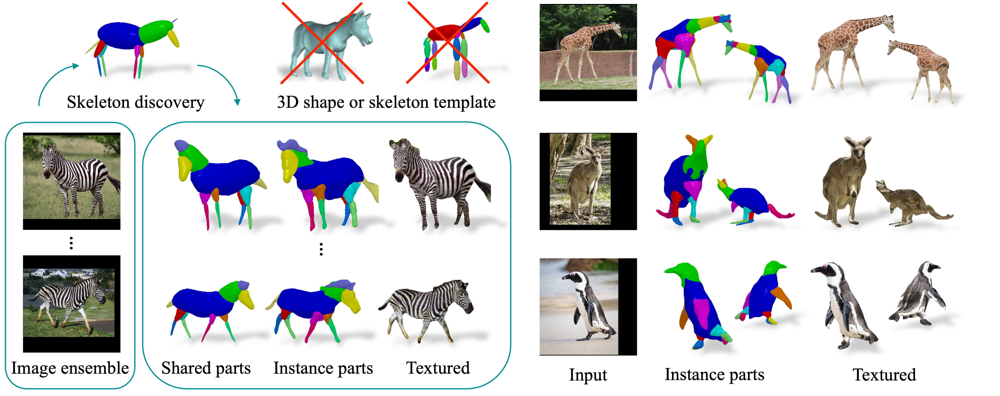

This is not an officially supported Google product.

# Hi-LASSIE: High-Fidelity Articulated Shape and Skeleton Discovery from Sparse Image Ensemble (CVPR 2023)
### [Project Page](https://chhankyao.github.io/hi-lassie/) | [Video](https://youtu.be/s9FWABEm0WU) | [Paper](https://arxiv.org/abs/2212.11042)

Implementation for Hi-LASSIE. A novel method which discovers 3D skeleton and detailed shapes of articulated animal bodies from sparse unannotated images in-the-wild.

[Chun-Han Yao](https://www.chhankyao.com/)<sup>1</sup>, [Wei-Chih Hung](https://hfslyc.github.io/)<sup>2</sup>, [Yuanzhen Li](http://people.csail.mit.edu/yzli/)<sup>3</sup>, [Michael Rubinstein](http://people.csail.mit.edu/mrub/)<sup>3</sup>, [Ming-Hsuan Yang](http://faculty.ucmerced.edu/mhyang/)<sup>134</sup><br>, [Varun Jampani](https://varunjampani.github.io)<sup>3</sup><br>
<sup>1</sup>UC Merced, <sup>2</sup>Waymo, <sup>3</sup>Google Research, <sup>4</sup>Yonsei University




## Setup

This repo is largely based on [LASSIE](https://github.com/google/lassie). A python virtual environment is used for dependency management. The code is tested with Python 3.7, PyTorch 1.11.0, CUDA 11.3. First, to install PyTorch in the virtual environment, run:

```
pip install torch==1.11.0+cu113 torchvision==0.12.0+cu113 --extra-index-url https://download.pytorch.org/whl/cu113
```

Then, install other required packages by running:

```
pip install -r requirements.txt
```


## Data preparation

### LASSIE web images (zebra, giraffe, tiger, elephant, kangaroo, penguin)
* Download LASSIE images following [here](https://github.com/google/lassie) and place them in `data/lassie/images/`.
* Download LASSIE annotations following [here](https://github.com/google/lassie) and place them in `data/lassie/annotations/`.
* Preprocess LASSIE images and extract DINO features of an animal class (e.g. zebra) by running:
```
python preprocess_lassie.py --cls zebra
```
To accelerate feature clustering, try setting number of threads lower (e.g. `OMP_NUM_THREADS=4`).


### Pascal-part (horse, cow, sheep)
* Download Pascal images [here](http://host.robots.ox.ac.uk/pascal/VOC/voc2010/#devkit) and place them in `data/pascal_part/JPEGImages/`.
* Download Pascal-part annotations [here](http://roozbehm.info/pascal-parts/pascal-parts.html) and place them in `data/pascal_part/Annotations_Part/`.
* Download Pascal-part image sets following [here](https://github.com/google/lassie) and place them in `data/pascal_part/image-sets/`.
* Preprocess Pascal-part images and extract DINO features of an animal class (e.g. horse) by running:
```
python preprocess_pascal.py --cls horse
```


## Skeleton extraction

After preprocessing the input data, we extract a 3D skeleton from a specified reference image in the ensemble. For instance, run the following to use the 5-th instance as reference:
```
python extract_skeleton.py --cls zebra --idx 5
```

To obtain better 3D outputs, we recommend selecting an instance where most body parts are visible (e.g. clear side-view). One can also see the DINO feature clustering results in `results/zebra/` to select a good reference or try running the optimization with different skeletons.


## Hi-LASSIE optimization

To run Hi-LASSIE optimization on all images in an ensemble jointly, first run:

```
python train.py --cls zebra
```

After the joint optimization, we perform instance-specific fine-tuning on a particular instance (e.g. 0) by:
```
python train.py --cls zebra --inst True --idx 0
```

The qualitative results can be found in `results/zebra/`. The optimization settings can be changed in `main/config.py`. For instance, one can reduce the rendering resolution by setting `input_size` if out of memory.


## Evaluation

Once optimization on all instances is completed, quantitative evaluation can be done by running:

```
python eval.py --cls zebra
```

For the animal classes in LASSIE dataset, we report the keypoint transfer accuracy (PCK). For Pascal-part animals, we further calculate the 2D IoU against ground-truth masks.


## Citation

```
@inproceedings{yao2023hi-lassie,
  title         = {Hi-LASSIE: High-Fidelity Articulated Shape and Skeleton Discovery from Sparse Image Ensemble},
  author        = {Yao, Chun-Han and Hung, Wei-Chih and Li, Yuanzhen and Rubinstein, Michael and Yang, Ming-Hsuan and Jampani, Varun},
  booktitle     = {CVPR},
  year          = {2023},
}
```
